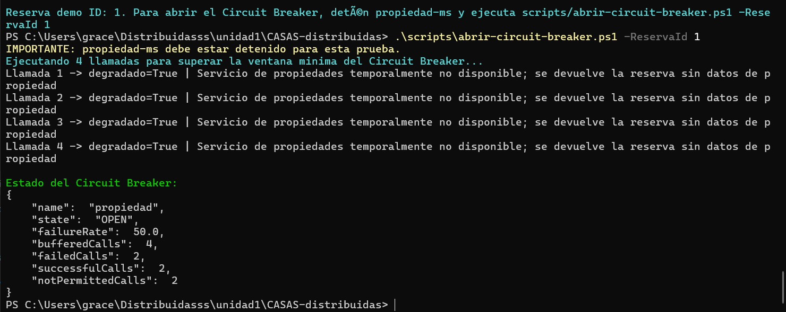
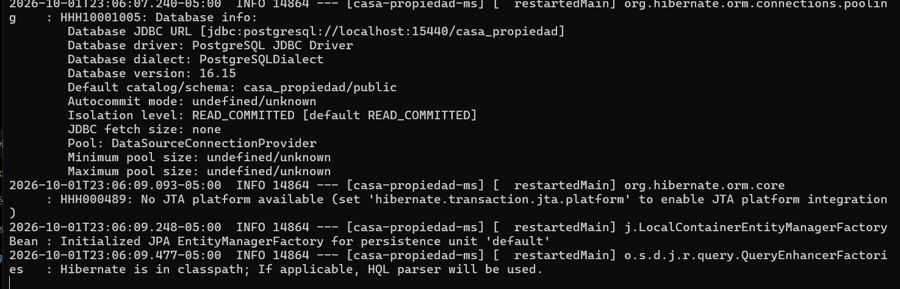

# S06 · Comunicación síncrona resiliente entre servicios

## Tarea 1 — Feign y Circuit Breaker

### Datos de la actividad

| Campo | Información |
|---|---|
| Grupo | 9 |
| Ciclo | V |
| Integrantes | Alanguia Japura Miguel Angel · Jannys Graciela Navarro Acrota · Olger Meza Rupa |
| Proyecto | CASA O NADA |
| Tema | OpenFeign + Eureka + Circuit Breaker |

## 1. Resumen de la actividad

La actividad implementa comunicación síncrona entre `casa-reserva-ms` y `casa-propiedad-ms`. La reserva necesita validar y consultar datos de una propiedad, por lo que utiliza **OpenFeign**. La ubicación del servicio no se escribe de forma fija: se resuelve mediante **Eureka**. Finalmente, **Resilience4j Circuit Breaker** protege el flujo cuando `propiedad-ms` deja de responder.

## 2. Evidencia técnica

Cada captura se ubica junto al paso que demuestra, siguiendo el mismo formato de evidencias utilizado en la Unidad I.

### Bloque 1 — Registro y descubrimiento de servicios

Antes de ejecutar la comunicación Feign se verificó que los componentes principales estuvieran registrados en Eureka.

#### Evidencia 01 · Servicios registrados en Eureka

<div class="evidence" markdown>


<p class="caption"><strong>Descripción.</strong> El panel de Eureka muestra <code>CASA-GATEWAY</code>, <code>CASA-PROPIEDAD-MS</code> y <code>CASA-RESERVA-MS</code> con estado <strong>UP</strong>. Esto confirma que los microservicios pueden descubrirse mediante sus nombres lógicos.</p>
</div>

### Bloque 2 — Verificación de infraestructura

#### Evidencia 02 · Gateway saludable y conectado a Eureka

<div class="evidence" markdown>


<p class="caption"><strong>Descripción.</strong> La consulta a <code>localhost:18080/actuator/health</code> devuelve estado general <strong>UP</strong>. En <code>discoveryComposite</code> aparecen los tres servicios registrados, verificando que el Gateway participa correctamente en el descubrimiento.</p>
</div>

### Bloque 3 — Comunicación declarativa con OpenFeign

El flujo probado fue el siguiente:

```text
Cliente
  ↓
Gateway
  ↓
reserva-ms
  ↓ OpenFeign + Eureka
propiedad-ms
  ↓
validación de propiedad
  ↓
reserva + detalle enriquecido
```

Con `propiedad-ms` disponible, la prueba automática creó una reserva y obtuvo su detalle enriquecido. El resultado indicó `degradado=false` y el mensaje `Propiedad consultada correctamente desde propiedad-ms`.

| Comprobación | Resultado |
|---|---|
| Comunicación `reserva-ms → propiedad-ms` | Correcta |
| Descubrimiento por Eureka | Correcto |
| Reserva creada | Correcta |
| Detalle de propiedad | Disponible |
| Modo degradado | `false` |
| Estado inicial del Circuit Breaker | `CLOSED` |

### Bloque 4 — Circuit Breaker y fallback

Para demostrar resiliencia se detuvo `propiedad-ms` y se realizaron llamadas repetidas. En lugar de provocar una caída total, `reserva-ms` devolvió una respuesta degradada y el Circuit Breaker alcanzó el estado `OPEN`.

#### Evidencia 03 · Circuit Breaker en estado OPEN

<div class="evidence" markdown>



<p class="caption"><strong>Descripción.</strong> Las cuatro llamadas de prueba muestran <code>degradado=True</code> y el mensaje de servicio temporalmente no disponible. El estado final es <code>OPEN</code>, con <code>failureRate: 50.0</code>, 4 llamadas registradas, 2 fallidas, 2 exitosas y 2 no permitidas. Esto evidencia que el circuito deja de insistir sobre una dependencia caída y activa el fallback.</p>
</div>

### ¿Por qué el failureRate es 50 %?

La ventana contiene llamadas exitosas realizadas antes de detener `propiedad-ms` y llamadas fallidas posteriores. Al alcanzar el umbral configurado, el Circuit Breaker abre el circuito; las siguientes peticiones ya no intentan llegar al servicio caído y se resuelven mediante el fallback.

### Bloque 5 — Recuperación del servicio

Después de la prueba de fallo se volvió a iniciar `propiedad-ms` para comprobar que el componente pudiera regresar al ecosistema.

#### Evidencia 04 · Propiedad-ms recuperado

<div class="evidence" markdown>



<p class="caption"><strong>Descripción.</strong> La consola de <code>casa-propiedad-ms</code> muestra la conexión con PostgreSQL, la inicialización de JPA y la carga del contexto del servicio. Esta evidencia corresponde al restablecimiento de la dependencia utilizada por <code>reserva-ms</code> después de provocar la apertura del Circuit Breaker.</p>
</div>

## 3. Reproducción técnica

1. Levantar Config Server, Eureka, Gateway, `propiedad-ms` y `reserva-ms`.
2. Confirmar en Eureka que Gateway, Propiedad y Reserva estén `UP`.
3. Ejecutar el script de pruebas para crear la propiedad y la reserva.
4. Confirmar que la consulta Feign devuelve el detalle enriquecido con `degradado=false`.
5. Detener `propiedad-ms`.
6. Ejecutar `scripts/abrir-circuit-breaker.ps1 -ReservaId 1`.
7. Verificar las respuestas degradadas y el estado `OPEN`.
8. Reiniciar `propiedad-ms` y comprobar su recuperación.

## 4. Hallazgo técnico

La comunicación síncrona introduce una dependencia temporal: si `reserva-ms` espera indefinidamente a `propiedad-ms`, un fallo remoto puede propagarse. El Circuit Breaker evita esa propagación al detectar fallos, abrir el circuito y utilizar una respuesta alternativa controlada.

## 5. Reflexión técnica

Feign simplifica la llamada entre microservicios y Eureka evita depender de direcciones físicas. Sin embargo, el descubrimiento por sí solo no resuelve las caídas. La combinación **Feign + Eureka + Circuit Breaker** permite comunicación declarativa, descubrimiento dinámico y tolerancia a fallos.

## 6. Preguntas de defensa

| Pregunta | Respuesta |
|---|---|
| ¿Para qué se usa Feign? | Para declarar un cliente HTTP y consumir otro microservicio con menos código manual. |
| ¿Qué aporta Eureka? | Permite localizar servicios por nombre lógico. |
| ¿Qué problema resuelve el Circuit Breaker? | Evita insistir continuamente sobre un servicio que está fallando. |
| ¿Qué significa `OPEN`? | El circuito está abierto y bloquea temporalmente llamadas hacia la dependencia fallida. |
| ¿Qué hace el fallback? | Devuelve una respuesta controlada cuando la llamada remota no puede completarse. |
