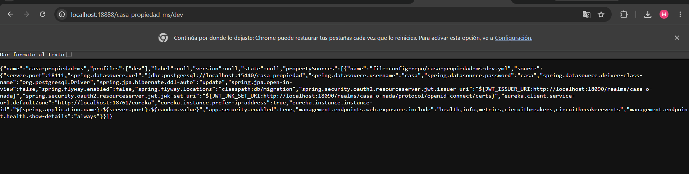
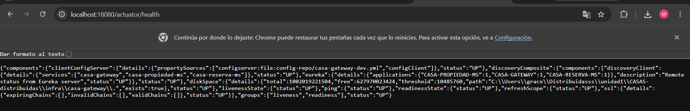
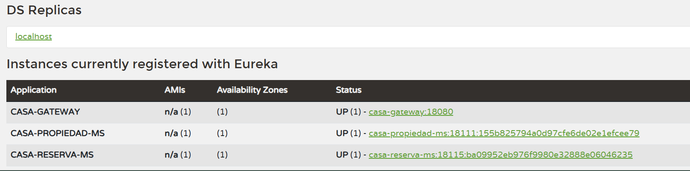

# S07 · Seguridad distribuida y control de acceso

## Tarea 2 — JWT

### Datos de la actividad

| Campo | Información |
|---|---|
| Grupo | 9 |
| Ciclo | V |
| Integrantes | Alanguia Japura Miguel Angel · Jannys Graciela Navarro Acrota · Olger Meza Rupa |
| Proyecto | CASA O NADA |
| Tema | JWT + Keycloak + Spring Security |

## 1. Resumen de la actividad

La segunda tarea protege la arquitectura distribuida mediante **JWT**. Keycloak actúa como proveedor de identidad y emite tokens firmados. Los servicios validan el emisor y las claves del token mediante Spring Security OAuth2 Resource Server. Los roles incluidos en el JWT permiten diferenciar las operaciones autorizadas para `CLIENTE` y `AGENTE`.

## 2. Arquitectura de seguridad

```text
Usuario
  │ credenciales
  ▼
Keycloak
  │ JWT firmado
  ▼
Gateway / microservicios
  │ valida issuer + firma + roles
  ├── autorizado → recurso
  └── no autorizado → 401 / 403
```

## 3. Configuración centralizada del Resource Server

La configuración de seguridad se obtiene desde Config Server. En ella se definen el `issuer-uri` y el `jwk-set-uri` del realm `casa-o-nada`.

#### Evidencia 01 · Configuración JWT de propiedad-ms

<div class="evidence" markdown>



<p class="caption"><strong>Descripción.</strong> La respuesta de Config Server para <code>casa-propiedad-ms/dev</code> incluye <code>spring.security.oauth2.resourceserver.jwt.issuer-uri</code> y <code>jwk-set-uri</code> apuntando al realm <code>casa-o-nada</code> de Keycloak. También se observan la configuración de Eureka, PostgreSQL y los endpoints de Actuator.</p>
</div>

## 4. Infraestructura protegida y saludable

La seguridad se integró sin perder observabilidad ni descubrimiento de servicios.

#### Evidencia 02 · Gateway en estado UP

<div class="evidence" markdown>



<p class="caption"><strong>Descripción.</strong> El endpoint de Actuator del Gateway devuelve <strong>UP</strong> y muestra los servicios descubiertos por Eureka. Esto confirma que la incorporación de seguridad no impide el funcionamiento de la infraestructura distribuida.</p>
</div>

#### Evidencia 03 · Microservicios disponibles en Eureka

<div class="evidence" markdown>



<p class="caption"><strong>Descripción.</strong> Eureka mantiene registrados Gateway, Propiedad y Reserva en estado <strong>UP</strong>. Esta evidencia complementa la prueba de seguridad al confirmar que las solicitudes protegidas se ejecutan sobre servicios activos.</p>
</div>

## 5. Obtención del JWT

Se solicitó un token al endpoint OpenID Connect de Keycloak utilizando el cliente `casa-o-nada-web`. El token obtenido corresponde al usuario `cliente` y contiene el rol `CLIENTE`.

```text
username: cliente
role: CLIENTE
issuer: http://localhost:18090/realms/casa-o-nada
```

La prueba automatizada leyó correctamente la identidad y los roles del JWT y devolvió **HTTP 200**.

## 6. Pruebas de autenticación y autorización

El script `test-s06-s07.ps1` comprobó distintos escenarios de seguridad.

| Prueba | Resultado | Interpretación |
|---|---:|---|
| Identidad y roles obtenidos desde JWT | `200` | Token válido |
| Recurso protegido sin token | `401` | Falta autenticación |
| `CLIENTE` intenta crear propiedad | `403` | Autenticado, pero sin permiso |
| `AGENTE` crea una propiedad | `201` | Rol autorizado |

### 6.1 HTTP 401 — sin autenticación

Una petición a un recurso protegido sin enviar `Authorization: Bearer <token>` fue rechazada con `401`. Esto demuestra que el recurso no puede utilizarse de forma anónima.

### 6.2 HTTP 403 — autenticado pero sin rol suficiente

El usuario `cliente` obtuvo un JWT válido, pero al intentar crear una propiedad recibió `403`. El sistema reconoce al usuario, pero el rol `CLIENTE` no posee autorización para esa operación.

### 6.3 HTTP 201 — operación autorizada

Con un token correspondiente al rol `AGENTE`, la creación de una propiedad fue aceptada y devolvió `201`. La propiedad de prueba quedó registrada con datos como título, ciudad, precio, habitaciones y agente asociado.

## 7. Diferencia entre 401 y 403

- **401 Unauthorized:** la solicitud no presenta una autenticación válida.
- **403 Forbidden:** el usuario sí está autenticado, pero no tiene el rol o permiso necesario.

Esta diferencia fue comprobada directamente durante las pruebas.

## 8. Reproducción técnica

1. Levantar Keycloak en `localhost:18090`.
2. Verificar el realm `casa-o-nada`.
3. Levantar Config Server, Eureka, Gateway y microservicios.
4. Solicitar un token para el usuario de prueba.
5. Ejecutar `scripts/test-s06-s07.ps1`.
6. Verificar `200` para identidad válida.
7. Verificar `401` al omitir el token.
8. Verificar `403` cuando `CLIENTE` intenta crear una propiedad.
9. Verificar `201` cuando `AGENTE` realiza la operación autorizada.

## 9. Reflexión técnica

JWT permite que cada petición transporte la identidad y los roles necesarios para tomar decisiones de autorización sin mantener una sesión tradicional en cada microservicio. Keycloak centraliza la identidad y Spring Security valida el token en los componentes protegidos.

## 10. Preguntas de defensa

| Pregunta | Respuesta |
|---|---|
| ¿Qué es JWT? | Un token firmado que transporta información de identidad y autorización. |
| ¿Quién emite el token? | Keycloak, desde el realm `casa-o-nada`. |
| ¿Qué valida el Resource Server? | La firma, el emisor, vigencia y datos necesarios del token. |
| ¿Por qué se obtuvo 401? | Porque se intentó acceder sin un token válido. |
| ¿Por qué se obtuvo 403? | Porque el usuario estaba autenticado, pero su rol no permitía la operación. |
| ¿Qué demuestra el 201 del AGENTE? | Que la autorización por rol permitió crear la propiedad. |
